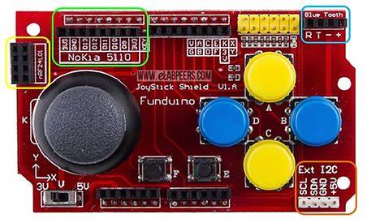

# IITBBS_GC-24_ArduGem_65_1

# Game Title
KAMI-KRAZE

## Description
This is a simple game built for Arduino using Adafruit_GFX and Adafruit_ST7735 libraries.
Embark on an adrenaline-fueled journey through the chaos of World War II skies. As a skilled tank commander, you must protect your territory from relentless aerial assaults by enemy planes. But beware, not all planes are created equal in this high-stakes battle for survival.

In Tank Defender, you control a powerful tank stationed on the ground, facing waves of incoming enemy aircraft. Your primary objective is to shoot down as many planes as possible while strategically managing your health to withstand the onslaught.

The sky is filled with two distinct types of planes: white and blue. White planes are standard aircraft, relatively easy to shoot down, but they're still a threat to your position. Destroying them earns you points, but they won't pose a significant danger if left unchecked.

However, the blue planes are a different story. These kamikaze planes are on a suicide mission, aiming to take you down with them. When destroyed, they plummet towards the ground, inflicting damage upon impact. The closer they are to your tank when they explode, the more devastating the damage. You must prioritize these blue planes, balancing the risk of taking them out with the potential damage they might inflict.

Amidst the chaos of the skies, enemy planes cleverly utilize evasive tactics, often hiding behind each other in an attempt to evade your tank's firepower, adding an extra layer of challenge to your mission. Stay sharp and adapt quickly to outmaneuver their cunning strategies and emerge victorious in the battle for supremacy.

To aid you in your mission, red circles periodically appear on the battlefield. Shooting these circles grants you valuable health boosts, replenishing your tank's vitality and extending your longevity in the fight. But be vigilant, as your health gradually decreases over time, adding an additional layer of challenge to your survival.

KAMI-KRAZE offers a thrilling blend of fast-paced action, strategic decision-making, and relentless tension as you fend off wave after wave of enemy planes. Can you prove yourself as a formidable tank commander and defend your territory against the relentless onslaught of WWII skies? Only time will tell in this gripping 2D arcade experience.

## Features
- Player control using joystick and buttons.
- Collision detection with obstacles and items.
- Scoring system based on collected items.
- Health system with life decrement over time.
- Game over screen with score display and option to restart or exit.
## Rules
Rules:
1. Objective: Your goal is to survive as long as possible while accumulating points by shooting down enemy planes, collecting items, and avoiding collisions with obstacles.
  
2. Player Controls:
   - Use the joystick to aim your shots and control the player character's vertical movement.
   - Press the left and right buttons to move the player character horizontally across the screen.

3. Scoring:
   - Destroying a white plane earns you 15 points.
   - Taking down a blue kamikaze plane rewards you with 50 points, but be cautious as they inflict damage upon destruction.
   - Shooting a red circle grants you 7 points and increases your health by 20.

4. Health:
   - Your health gradually decreases over time, so collect red circles to replenish it.
   - Colliding with obstacles reduces your health. Keep an eye on your health bar and avoid collisions to stay in the game.

5. Game Over:
   - The game ends when your health reaches zero.
   - At the game over screen, you have the option to restart the game or exit to the main menu.

## Hardware Requirements
- Arduino board (e.g., Arduino Uno)
- Adafruit ST7735 TFT display
- Joystick module
- Buttons (left, right, start)

## Installation
1. Clone or download the repository.
2. Connect the Arduino board to your computer.
3. Open the Arduino IDE.
4. Load the main game sketch (`game.ino`) into the IDE.
5. Make sure to install the required libraries: Adafruit_GFX, Adafruit_ST7735, and Wire.
6. Select the appropriate board and port from the Tools menu.
7. Upload the sketch to your Arduino board.

## Usage and Controls
1. Connect the Adafruit ST7735 TFT display, joystick module, and buttons to the Arduino board according to the wiring diagram provided.
2. Power on the Arduino board.
3. Follow the on-screen instructions to navigate the menu and start the game.
4. Use the joystick to control tank artillery aim.In order to aim rightward direction with respect of the user
   
5. Press the left and right buttons to move the tank horizontally across the screen.
6. Collect items to increase your score and health.
7. Avoid collisions with obstacles to prevent losing health.
8. The game ends when the player's health reaches zero. You can choose to restart or exit the game from the game over screen.

## Wiring Diagram
Creating a wiring diagram for connecting an Arduino, Funduino joystick shield, and an ST7735 TFT display involves several connections:

1. **Arduino to ST7735 TFT Display:**
    LED to 3.3V (or use a PWM pin for backlight control)
    SCK to Digital Pin 13 (SCLK)
    SDA to Digital Pin 11 (MOSI)
    A0/DC to Digital Pin 9 (Data/Command select)
    RESET to Digital Pin 8 (or to Arduino RESET pin)
    CS to Digital Pin 10 (Chip Select)
    GND to GND
    VCC to 5V
2. **Funduino Joystick Shield:**
    The joystick shield typically plugs directly into the Arduino, aligning with the corresponding pins.
3.**Connections Between Funduino and ST7735:**
    Since the joystick shield occupies the header pins of the Arduino, you'll need to make connections from the shield to the display. This can be done by soldering wires to the underside of the shield where the header pins are soldered or by using a shield that has breakout pins available.
    Also, remember to install the necessary libraries for the ST7735 display to work with your Arduino.

## Contributors
- Lakshya Arora     https://github.com/LakshyaArora123
- Vikas Maurya      https://github.com/VikasMaurya07
